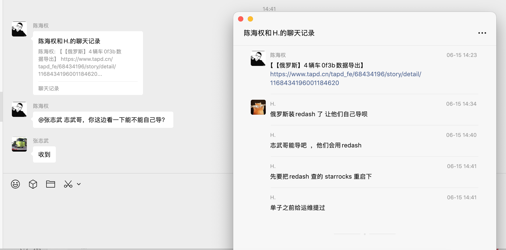

# 俄罗斯车辆数据导出沟通

- 来源：inbox/quick/2026-06-15-1458-陈海权向张志武转发其与H.关于俄罗斯4辆车数....md
- 捕获时间：2026-06-15 14:58
- 对话时间：2026-06-15
- 类型：chat-summary
- 来源工具：微信
- 归档领域：overseas-telematics
- 原始截图：assets/2026-06/2026-06-15-1458-俄罗斯车辆数据导出沟通.png

## 原始截图



## 简短结论

陈海权向张志武转发俄罗斯 4 辆车 `0f3b` 数据导出需求及相关背景，询问张志武侧能否自行导出数据；张志武已回复收到。引用背景中提到俄罗斯环境已安装 Redash，可用于自行导出；相关查询依赖的 StarRocks 重启工单此前已提交运维。

## 原始聊天记录

```text
【引用上下文：陈海权和H.的聊天记录：
陈海权 06-15 14:23：【【俄罗斯】4辆车0f3b数据导出】https://www.tapd.cn/tapd_fe/68434196/story/detail/1168434196001184620
H. 06-15 14:34：俄罗斯装redash了 让他们自己导呗
H. 06-15 14:40：志武哥能导吧 ，他们会用redash
H. 06-15 14:41：先要把redash查的starrocks重启下
H. 06-15 14:41：单子之前给运维提过】
陈海权：@张志武 志武哥，你这边看一下能不能自己导？
张志武：收到
```
