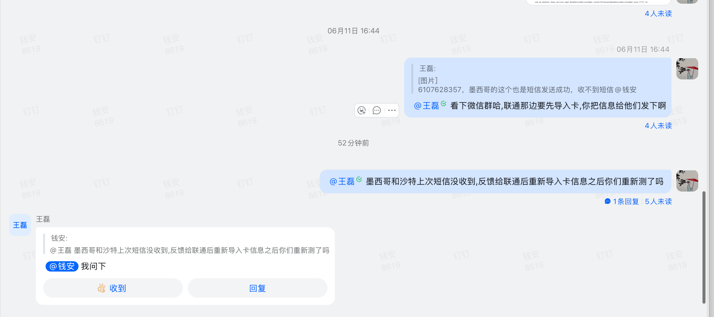

# 墨西哥沙特短信接收问题

- 来源：inbox/quick/2026-06-15-1445-反馈墨西哥号码6107628357提示短信发....md
- 捕获时间：2026-06-15 14:45
- 对话时间：2026-06-11 16:44 起
- 类型：chat-summary
- 来源工具：钉钉
- 归档领域：overseas-telematics
- 原始截图：assets/2026-06/2026-06-15-1445-墨西哥沙特短信接收问题.png

## 原始截图



## 简短结论

墨西哥号码 `6107628357` 出现短信发送成功但用户收不到的问题；同时关联墨西哥、沙特上次短信未收到的历史问题。当前处理方向是让王磊把相关卡信息发给联通，联通先导入卡信息；随后再确认重新导入后是否已重新测试短信接收。

## 原始聊天记录

```text
王磊：[图片]
6107628357，墨西哥的这个也是短信发送成功，收不到短信 @钱安
@王磊 看下微信群哈，联通那边要先导入卡，你把信息给他们发下啊
@王磊 墨西哥和沙特上次短信没收到，反馈给联通后重新导入卡信息之后你们重新测了吗
王磊：
[引用上下文：钱安：@王磊 墨西哥和沙特上次短信没收到，反馈给联通后重新导入卡信息之后你们重新测了吗]
@钱安 我问下
```
